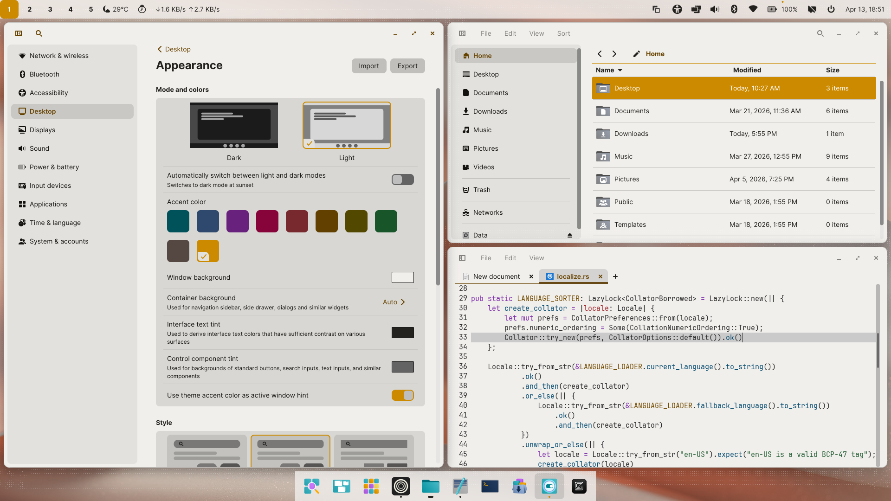
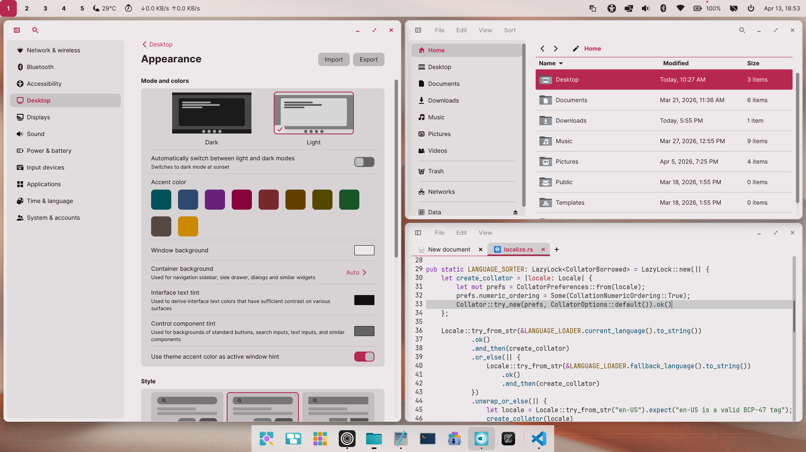
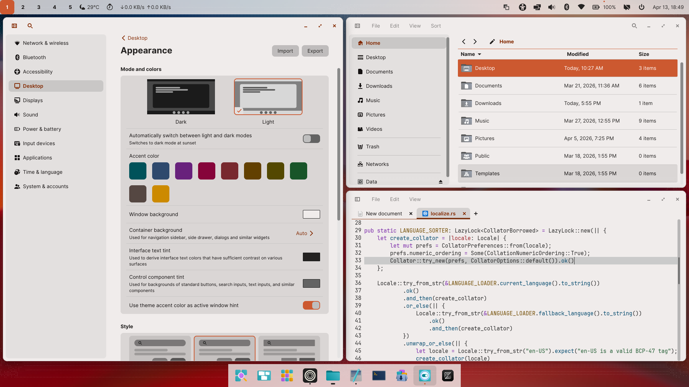

# Cosmic Desktop Themes

A collection of beautiful themes to customize and enhance the Cosmic Desktop Environment.

Note: This repository is not affiliated with the official COSMIC Desktop project.

## Official Themes

| **Comet Light** | **Cosmic Dark** |
|------------------|-----------------|
|  |  |

| **Cosmic Light** | **Creme Light** |
|------------------|-----------------|
|  |  |

| **Mocha Dark** | **Nebula Dark** |
|------------------|-----------------|
|  |  |

## Dark Themes

| **Accent Dark** | **Busy Bee** |
|------------------|-----------------|
|  |  |

| **Caramel Dark** | **Cosmic Abyss** |
|------------------|-----------------|
|  |  |

| **Cosmic Crimson** | **Flaming Ruby** |
|------------------|-----------------|
|  |  |

| **Graphite Glow Dark** | **Hot Iron** |
|------------------|-----------------|
|  |  |

| **Lunar Eclipse** | **Mint Dark** |
|------------------|-----------------|
|  |  |

| **Monokai Dark** | **Obsidian** |
|------------------|-----------------|
|  |  |

| **Ocean Mist** | **Omnitrix** |
|------------------|-----------------|
|  |  |

| **Shadcn Dark** | **Steam Client** |
|------------------|-----------------|
|  |  |

| **Sunset Ash Dark** | **Ubuntu Classic Dark** |
|------------------|-----------------|
|  |  |

| **Void Dream** |
|-----------------|
|  |

## Light Themes

| **Accent Light** | **Caramel Light** |
|------------------|-----------------|
|  |  |

| **Graphite Glow Light** | **Lemon Grass** |
|-------------------------|----------------|
|  |  |

| **Maroon Mirage** | **Mint Light** |
|-------------------|---------------|
|  |  |

| **Monokai Light** | **Royal Orchid** |
|-------------------|-----------------|
|  |  |

| **Shadcn Light** | **Sunset Ash Light** |
|------------------|----------------------|
|  |  |

| **Ubuntu Classic Light** | **Ubuntu Light** |
|--------------------|-----------------|
|  |  |

### How to Apply a Theme
1. Open Cosmic Settings.
2. Navigate to Desktop > Appearance.
3. Import desired theme file. 

Enjoy customizing your desktop with themes made for Cosmic!
